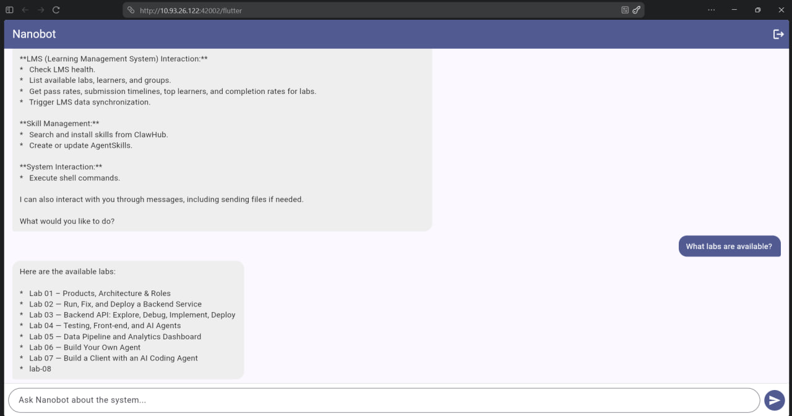
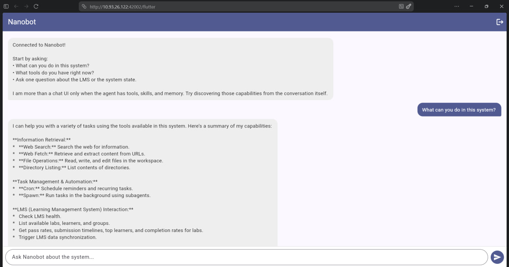

# Lab 8 — Report

Paste your checkpoint evidence below. Add screenshots as image files in the repo and reference them with ``.

## Task 1A — Bare agent

### "What is the agentic loop?"

```
🐈 nanobot
The agentic loop is a cyclical process where an AI agent autonomously performs actions, receives feedback, and iterates to achieve     
goals. Here's a structured breakdown:                                                                                                  

---------------------------------------------------------------------------------------------------------------------------------------

Core Components                                                                                                                        

 1 Action:                                                                                                                             
   The agent executes a task using tools (e.g., APIs, databases).                                                                      
   Example: Calling the LMS MCP server to fetch lab data.                                                                              
 2 Feedback:                                                                                                                           
   Results are analyzed to determine success/failure.                                                                                  
   Example: Checking if a tool call returns valid lab names.                                                                           
 3 Iteration:                                                                                                                          
   The agent adjusts its strategy based on feedback and repeats the cycle.                                                             
   Example: If a lab parameter is missing, the agent asks the user for clarification.                                                  

---------------------------------------------------------------------------------------------------------------------------------------

Key Safeguards                                                                                                                         

 • Iteration Limits: Tools like maxIterations(5) prevent infinite loops.                                                               
 • Human Oversight: Critical for complex tasks (e.g., legal case updates).                                                             
 • Tool Validation: MCP servers ensure tools are typed and secure.                                                                     

---------------------------------------------------------------------------------------------------------------------------------------

Practical Example in nanobot                                                                                                           

 1 Query: User asks, "What labs are available?"                                                                                        
 2 Action: Agent calls the MCP server (lms_health) to fetch lab data.                                                                  
 3 Feedback: Server returns lab names (e.g., lab-01, lab-02).                                                                          
 4 Iteration: Agent formats the response and confirms completion.                                                                      

---------------------------------------------------------------------------------------------------------------------------------------

Why It Matters                                                                                                                         

 • Autonomy: Reduces manual reimplementation of workflows.                                                                             
 • Reusability: Tools like MCP servers can be shared across agents.                                                                    
 • Safety: Iteration limits and human-in-the-loop checks prevent errors.                                                               

For deeper details, refer to the nanobot documentation or the MCP server guide.       
```

### "What labs are available in our LMS?"

```
🐈 nanobot
The agentic loop is a cyclical process where an AI agent autonomously performs actions, receives feedback, and iterates to achieve     
goals. Here's a structured breakdown based on the tools and context:                                                                   

---------------------------------------------------------------------------------------------------------------------------------------

Core Definition                                                                                                                        

An agentic loop involves:                                                                                                              

 1 Action: The agent executes a task using tools (e.g., APIs, databases).                                                              
 2 Feedback: Results are analyzed to determine success/failure.                                                                        
 3 Iteration: The agent adjusts its strategy based on feedback and repeats the cycle.                                                  

---------------------------------------------------------------------------------------------------------------------------------------

Key Components in Practice                                                                                                             

 • Tools: External systems (e.g., MCP servers in the nanobot framework) that the agent interacts with.                                 
 • Feedback Mechanisms: Logging, user input, or automated checks to evaluate outcomes.                                                 
 • Safeguards:                                                                                                                         
    • maxIterations limits (e.g., maxIterations(5) in ADK) to prevent infinite loops.                                                  
    • Human oversight for complex tasks (e.g., legal case updates).                                                                    

---------------------------------------------------------------------------------------------------------------------------------------

Example Workflow                                                                                                                       

 1 Query: User asks, "What labs are available?"                                                                                        
 2 Action: Agent calls the MCP server (lms_health) to fetch lab data.                                                                  
 3 Feedback: Server returns lab names (e.g., lab-01, lab-02).                                                                          
 4 Iteration: Agent formats the response and confirms completion.                                                                      

---------------------------------------------------------------------------------------------------------------------------------------

Implementation in nanobot                                                                                                              

 • MCP Server: Exposes backend services (e.g., lms_health) as typed tools.                                                             
 • Agent Configuration: Defined in nanobot/config.json, specifying tools and parameters.                                               
 • Execution: Agent runs in a terminal session, interacting with tools via CLI commands.                                               

---------------------------------------------------------------------------------------------------------------------------------------

Why It Matters                                                                                                                         

 • Autonomy: Reduces manual reimplementation of workflows.                                                                             
 • Reusability: Tools like MCP servers can be shared across agents.                                                                    
 • Safety: Iteration limits and human-in-the-loop checks prevent errors.                                                               

For deeper details, refer to the nanobot documentation or the MCP server guide.        
```

## Task 1B — Agent with LMS tools

### "What labs are available?"

```
🐈 nanobot
The following labs are available in the LMS:                                                                         

 1 Lab 01 – Products, Architecture & Roles                                                                           
 2 Lab 02 — Run, Fix, and Deploy a Backend Service                                                                   
 3 Lab 03 — Backend API: Explore, Debug, Implement, Deploy                                                           
 4 Lab 04 — Testing, Front-end, and AI Agents                                                                        
 5 Lab 05 — Data Pipeline and Analytics Dashboard                                                                    
 6 Lab 06 — Build Your Own Agent                                                                                     
 7 Lab 07 — Build a Client with an AI Coding Agent                                                                   
 8 lab-08 (current lab)                                                                                              
```

### "Describe the architecture of the LMS system"

```
🐈 nanobot
The Learning Management Service (LMS) is a full-stack educational platform built with a monolith architecture. Here's
a concise overview:                                                                                                  

---------------------------------------------------------------------------------------------------------------------

Core Components                                                                                                      

 1 Frontend                                                                                                          
    • React SPA (TypeScript) served as static files by Caddy.                                                        
    • Flutter web app (optional) for mobile-friendly access.                                                         
    • Both connect to the backend via a single-origin setup (no CORS).                                               
 2 Backend                                                                                                           
    • FastAPI (Python) with async SQLAlchemy.                                                                        
    • Exposes REST endpoints (/items, /learners, /interactions) with Swagger UI at /docs.                            
    • Authentication via Bearer token (API_KEY).                                                                     
 3 Database                                                                                                          
    • PostgreSQL with tables: item (learning content hierarchy), learner (students), interacts (interaction logs).   
    • Schema follows OBER (Outcome-Based Educational Recommender) principles.                                        
 4 AI Agent                                                                                                          
    • Nanobot (Python) runs as a separate service.                                                                   
    • Accepts WebSocket connections (ws://nanobot:8765) from both the Flutter app and the Telegram bot.              
    • Uses MCP tools to query the LMS backend.                                                                       
 5 Infrastructure                                                                                                    
    • Caddy reverse proxy: serves frontends, proxies API requests, handles TLS.                                      
    • pgAdmin for database management.                                                                               
    • All services orchestrated via Docker Compose.                                                                  

---------------------------------------------------------------------------------------------------------------------

Key Design Decisions                                                                                                 

 • Monolith with layered structure (routers → DB access → models) for simplicity and pedagogy.                       
 • Async database access to match FastAPI's ASGI model.                                                              
 • Feature flags (BACKEND_ENABLE_*) to incrementally enable endpoints across labs.                                   
 • Structured WebSocket protocol (typed JSON messages: text, choice, confirm) for rich UI interactions.              
 • Access control via WebSocket query parameter (?access_key=...) for the web client; server-side LMS API key remains
   secret.                                                                                                           

---------------------------------------------------------------------------------------------------------------------

Data Flow Example                                                                                                    

 1 Student opens browser → Caddy serves React SPA.                                                                   
 2 SPA calls GET /items → Caddy proxies to FastAPI → API queries PostgreSQL → returns JSON.                          
 3 Student completes a task → SPA sends POST /interactions → logged in DB.                                           
 4 Student asks AI agent via chat → WebSocket message to Nanobot → agent uses MCP tools to fetch LMS data → returns  
   structured response.                                                                                              

---------------------------------------------------------------------------------------------------------------------

Extensibility                                                                                                        

 • MCP tools allow the agent to interact with the LMS without hardcoding API calls.                                  
 • Skills (prompt-based strategies) guide the agent's behavior.                                                      
 • Custom routers can be added to the FastAPI app for new endpoints.                                                 

This architecture balances simplicity for learning with real-world patterns (reverse proxy, async I/O, typed         
protocols).                                                                                                          
```

## Task 1C — Skill prompt

<!-- Paste the agent's response to "Show me the scores" (without specifying a lab) -->

## Task 2A — Deployed agent

Paste a short excerpt from:

`docker compose --env-file .env.docker.secret logs nanobot --tail 50`

Example template (replace with your real lines):

```
🐈 nanobot
Starting nanobot gateway version … on port …
Using config: /app/nanobot/config.resolved.json
✓ Heartbeat: every …
```

## Task 2B — Web client

Screenshot of a conversation with the agent in the Flutter web app:





## Task 3A — Structured logging

### Successful request
request_started
auth_success
db_query
request_completed
GET /items/ HTTP/1.1 200 OK

### Error request
ERROR [app.db.items] - db_query
request_completed
GET /items/ HTTP/1.1 404 Not Found

### VictoriaLogs screenshot


## Task 3B — Traces

<!-- Screenshots: healthy trace span hierarchy, error trace -->

Healthy Trace

 
Error Trace


## Task 3C — Observability MCP tools

<!-- Paste agent responses to "any errors in the last hour?" under normal and failure conditions -->

## Task 4A — Multi-step investigation

<!-- Paste the agent's response to "What went wrong?" showing chained log + trace investigation -->

## Task 4B — Proactive health check

<!-- Screenshot or transcript of the proactive health report that appears in the Flutter chat -->

## Task 4C — Bug fix and recovery

<!-- 1. Root cause identified
     2. Code fix (diff or description)
     3. Post-fix response to "What went wrong?" showing the real underlying failure
     4. Healthy follow-up report or transcript after recovery -->
